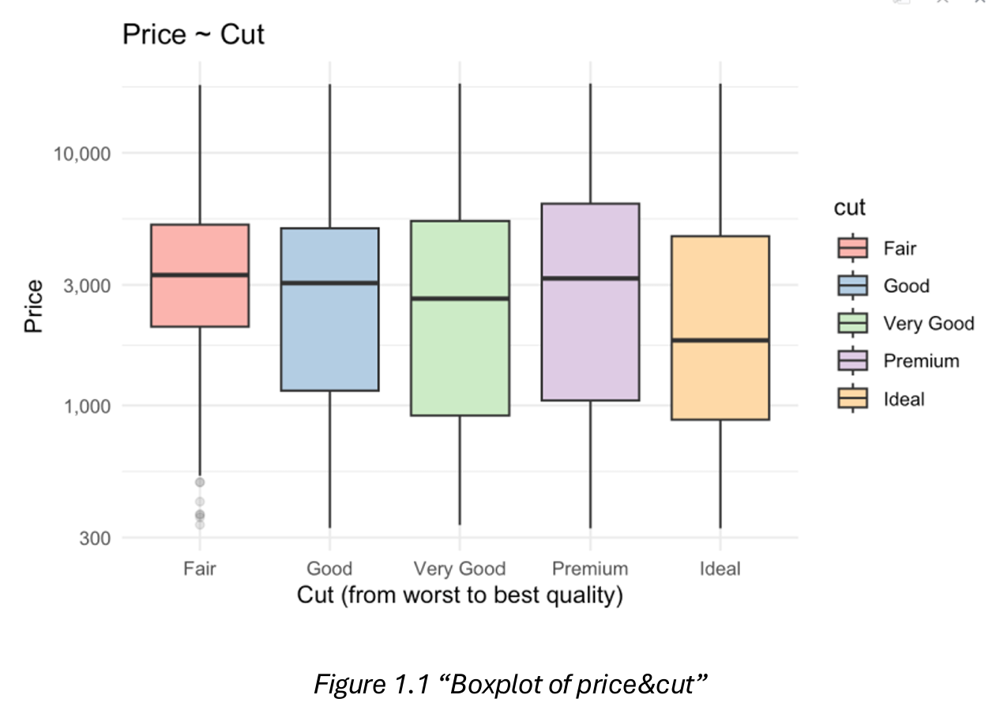
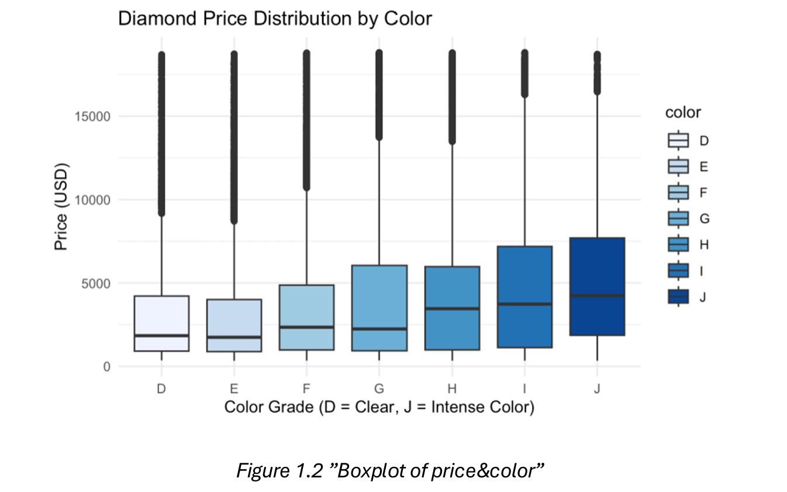
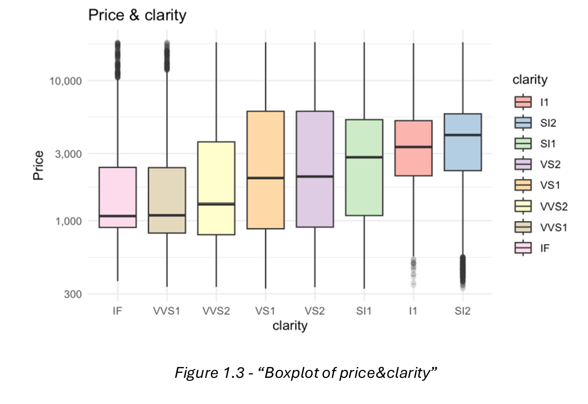
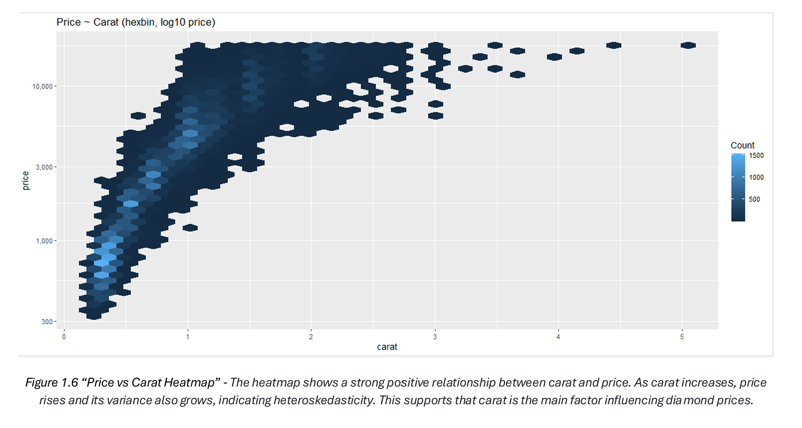
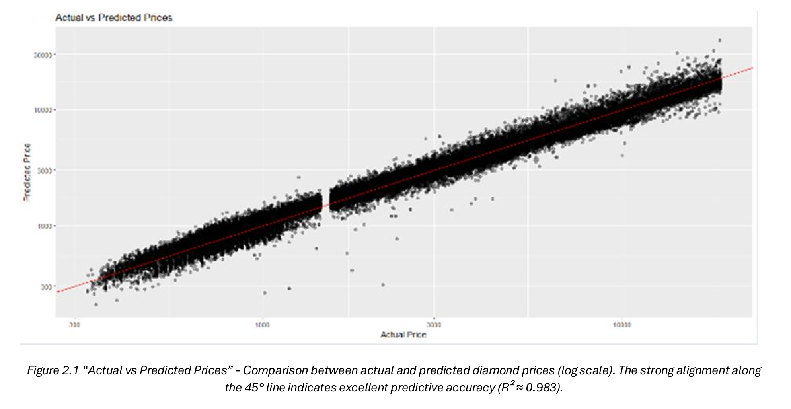
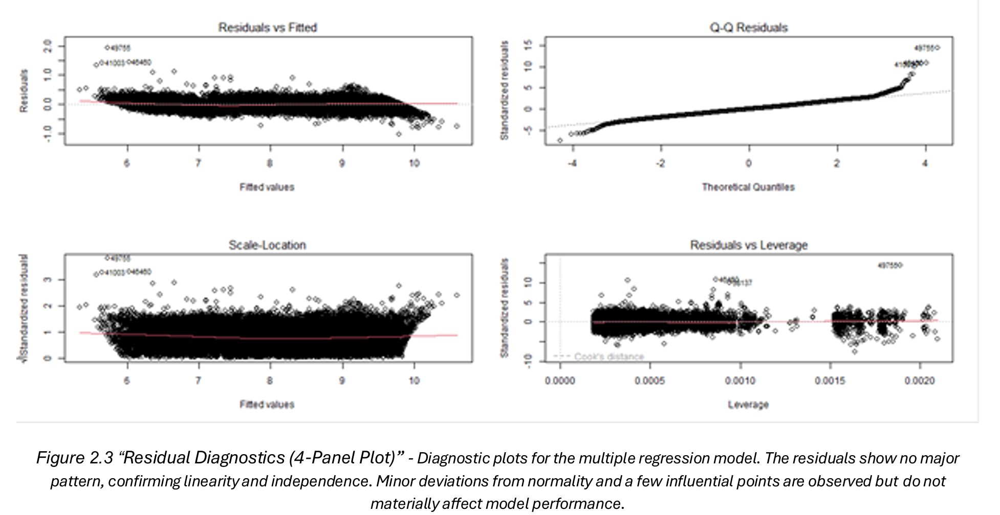

# Diamond Pricing Model (R)

Interpretable diamond pricing model using the ggplot2 `diamonds` dataset (n = 53,940).

## Key Results
- Final model: Adjusted R² = 0.983
- 10-fold CV: RMSE = 0.134, R² ≈ 0.983, MAE = 0.104
- Main driver: carat (elasticity ≈ 1.88)
- Secondary drivers: clarity, cut; color negative
- depth and table not significant

## Figures (selected)

### Figure 1.1 — Price vs Cut

### Figure 1.2 — Price vs Color

### Figure 1.3 — Price vs Clarity

### Figure 1.6 — Price vs Carat (Hexbin)

### Figure 2.1 — Actual vs Predicted

### Figure 2.3 — Residual Diagnostics

## Code
- Main analysis: `report/diamonds_pricing.qmd`

## How to run
Open `report/diamonds_pricing.qmd` in RStudio and render with Quarto.
